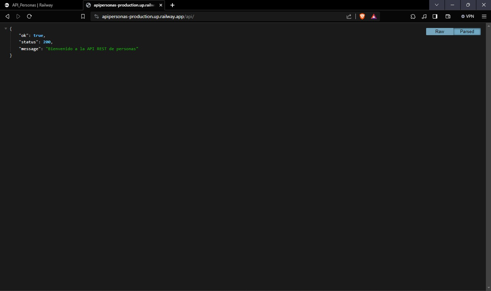
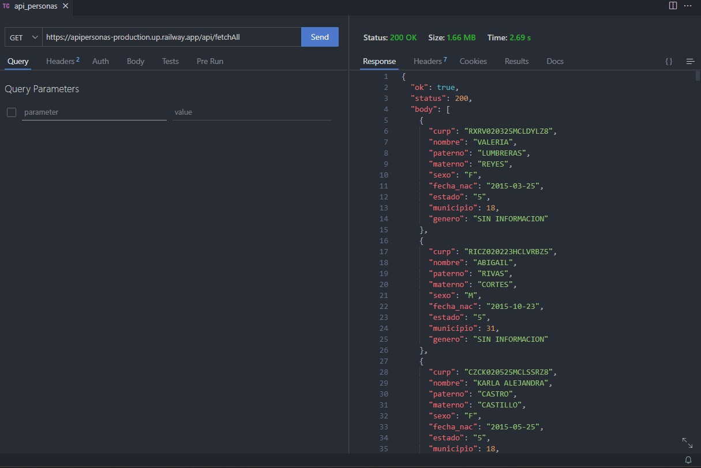
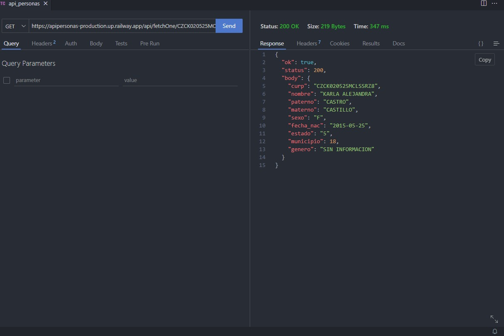
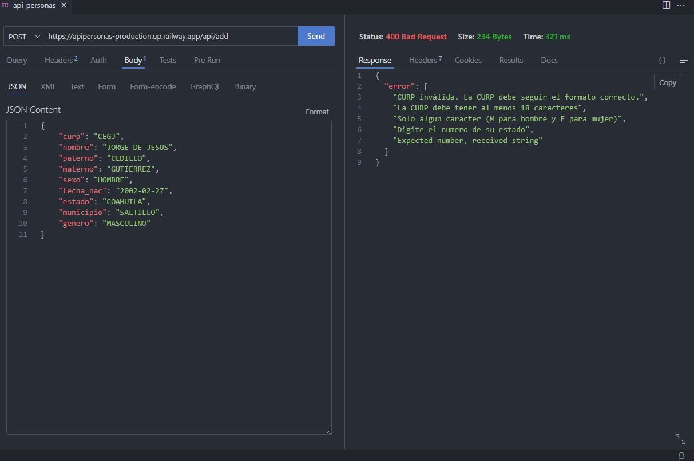
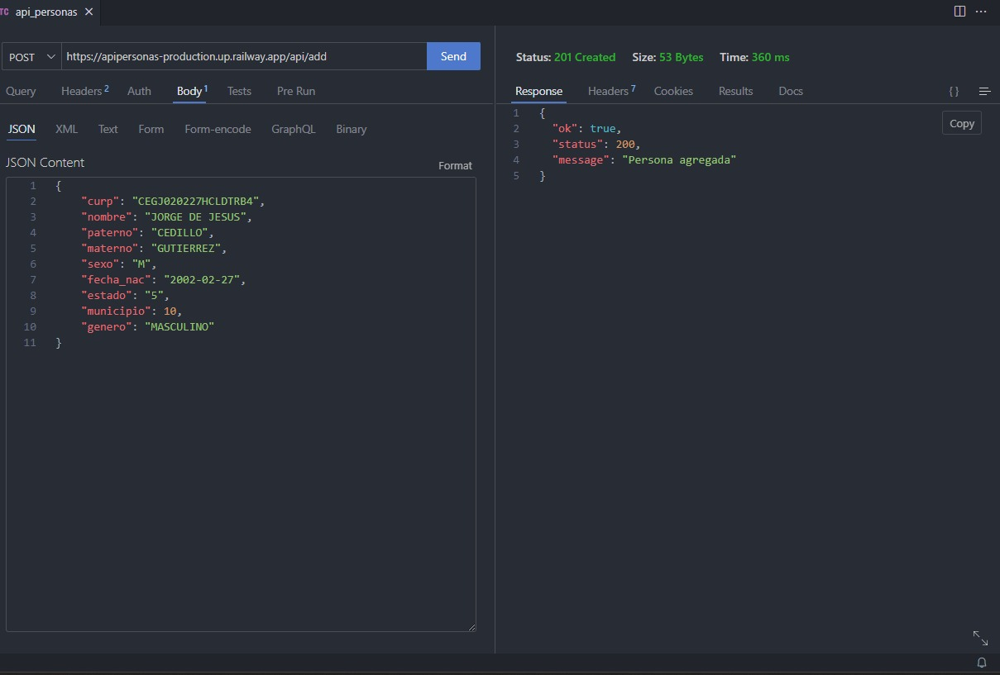
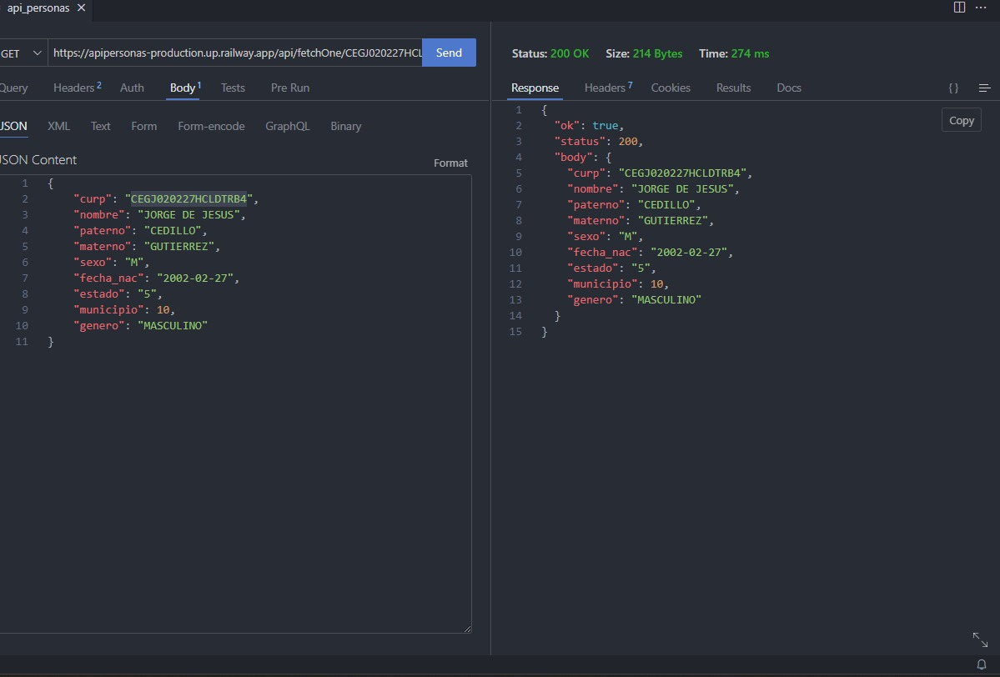
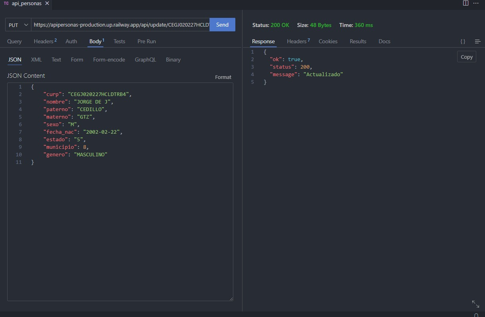
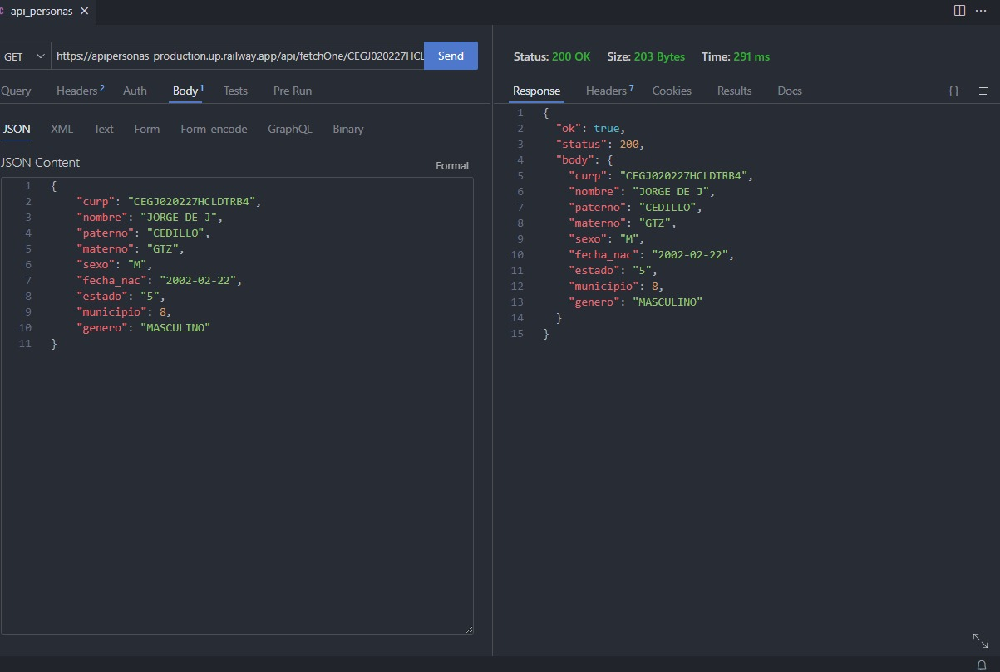
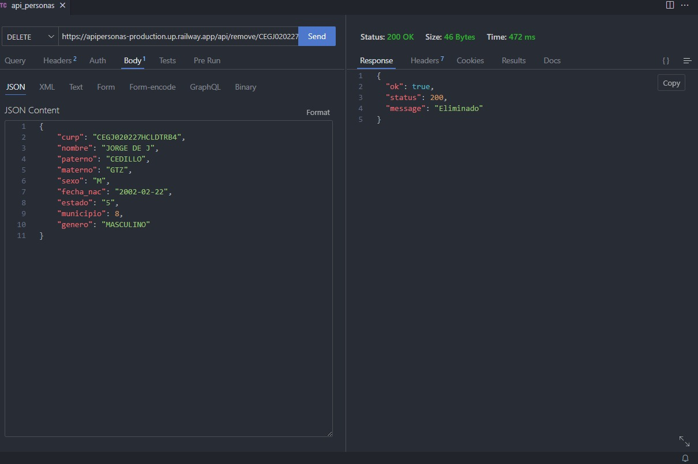
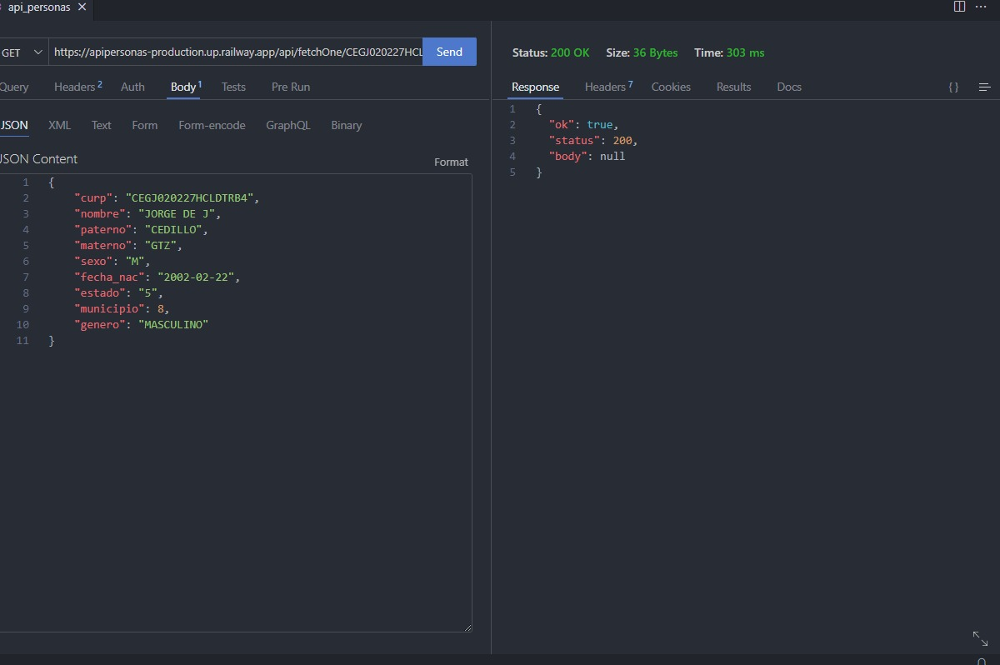

# API de Personas

Este es un proyecto de API en Node.js que utiliza Express para crear un servidor, Sequelize como ORM para conectarse a una base de datos MySQL y realizar operaciones CRUD en registros de personas. Además, se utiliza Zod para la validación de datos con esquemas.

## Instrucciones de uso

### 1. Página de Bienvenida

- **URL:** `https://apipersonas-production.up.railway.app/api/api/`
- **Método:** GET
- **Descripción:** Esta ruta proporciona un mensaje de bienvenida.



### 2. Listar Todos los Registros

- **URL:** `https://apipersonas-production.up.railway.app/api/fetchAll`
- **Método:** GET
- **Descripción:** Esta ruta devuelve todos los registros de la tabla "personas" en formato JSON.



### 3. Buscar por CURP

- **URL:** `https://apipersonas-production.up.railway.app/api/fetchOne/:curp`
- **Método:** GET
- **Descripción:** Esta ruta devuelve el registro asociado a la CURP proporcionada en el parámetro `curp` de la solicitud.



### 4. Agregar Registro

- **URL:** `https://apipersonas-production.up.railway.app/api/add`
- **Método:** POST
- **Descripción:** Esta ruta permite ingresar un nuevo registro a la base de datos. Debe enviarse un objeto JSON en el cuerpo de la solicitud con los datos de la persona a agregar.







### 5. Actualizar Registro

- **URL:** `https://apipersonas-production.up.railway.app/api/update/:curp`
- **Método:** PUT
- **Descripción:** Esta ruta permite actualizar un registro existente. Debe proporcionarse la CURP del registro que se desea actualizar en el parámetro `curp` de la solicitud y enviar un objeto JSON en el cuerpo de la solicitud con los datos actualizados.





### 6. Eliminar Registro

- **URL:** `https://apipersonas-production.up.railway.app/api/remove/:curp`
- **Método:** DELETE
- **Descripción:** Esta ruta elimina el registro asociado a la CURP proporcionada en el parámetro `curp` de la solicitud.





## Ejemplo de solicitud (cURL)

```bash
# Obtener todos los registros
curl -X GET https://apipersonas-production.up.railway.app/api/fetchAll

# Buscar por CURP
curl -X GET https://apipersonas-production.up.railway.app/api/fetchOne/XXXXXXXXXXXXXXXXXX

# Agregar registro
curl -X POST -H "Content-Type: application/json" -d '{"curp": "XXXXXXXXXXXXXXXXXX", "nombre": "Nombre", "apellido_paterno": "Apellido", "apellido_materno": "Apellido", "sexo": "M", "fecha_nacimiento": "2000-01-01", "estado": "Estado", "municipio": "Municipio", "genero": "Otro"}' https://apipersonas-production.up.railway.app/api/add

# Actualizar registro
curl -X PUT -H "Content-Type: application/json" -d '{"nombre": "Nuevo Nombre"}' https://apipersonas-production.up.railway.app/api/update/XXXXXXXXXXXXXXXXXX

# Eliminar registro
curl -X DELETE https://apipersonas-production.up.railway.app/api/remove/XXXXXXXXXXXXXXXXXX
